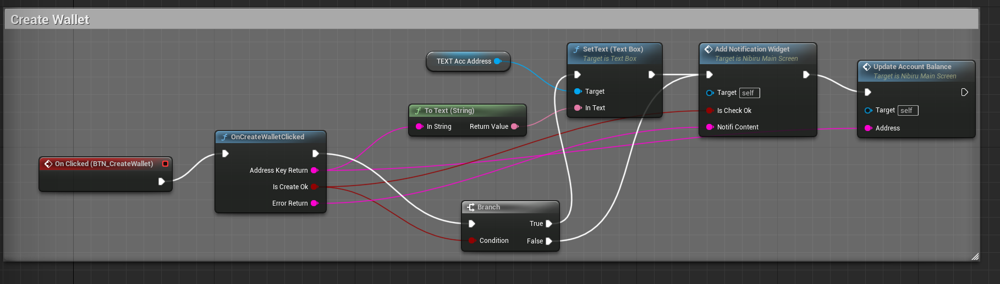
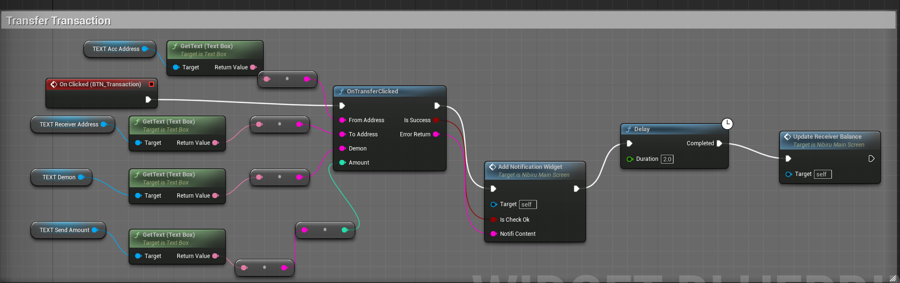
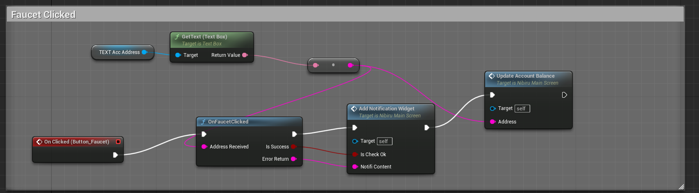

# Unreal-Nibi-SDK

Unreal-Nibi-SDK is a cpp package written in C++ to help developers integrate Nibiru blockchain technology into their cpp and Unreal projects.

- [Project Layout](#project-layout)
- [Features](#features)
- [Requirements](#requirements)
- [Installation (For Mac)](#installation)
- [Unreal-Nibi-SDK with Blueprint](#using-unreal-nibi-sdk-with-blueprint)
- [Go API](#go-api)
- [Testing](#testing)
- [Deploy CW721 contract](#testing)

### Project Layout

1. **`UnrealExample/`**:: This directory contains Wallet example Unreal Project using Unreal-Nibi-SDK.
2. **`Resource/`**:: A place for various resources needed for the project, like images, data files, or other assets.
3. **`libs/`**: This directory houses a Go package specifically designed for connecting to and interacting with the blockchain, facilitating the initialization of the client for seamless integration with the project.
4. **`test/`**: This directory hosts Go unit test files to ensure the functionality, reliability, and performance of the associated components within the project.

### Features

1. **`Creating a Wallet`**: Generate new blockchain wallets to securely manage funds and conduct transactions.
2. **`Querying`**: Retrieve detailed information from the blockchain, such as transaction history, account balances, or smart contract data.
3. **`Transfer Token`**: Seamlessly transfer tokens between blockchain addresses with built-in security measures.
4. **`Mint NFT`**: Create unique and non-fungible tokens (NFTs) on the blockchain, enabling the creation and management of digital assets.

### Requirements

| Platforms   | Unreal Version   | Installation         | Status       |
| ----------- | ---------------- | -------------------- | ------------ |
| MacOS | Unity engine 5.4 | 3rd lib build config | Fully Tested |

### Installation

# Installation Guide

This guide provides step-by-step instructions for installing and setting up our library which is compatible macOS platforms. Ensure you have the following prerequisites installed to build the project:

## Prerequisites

**Go** : https://go.dev/doc/install

**Visual Studio Code** with C++ development environment

## Installation Steps

1. Install **Visual Studio Code** with C++ development environment
2. Install Go
3. Install Unreal 5.4.1

## Project Setup

You can run **setup.sh** to do all these steps to set up the project environment:

1. Clone the repository and initialize submodules:
   ```sh
   git clone <repository-url>
   cd <repository-name>
   git submodule update --init --recursive
   ```
2. Build the project:
   ```sh
   rm -f unreal_nibi_sdk.dylib
   go build -o unreal_nibi_sdk.dylib -buildmode=c-shared ./api.go
   ```
3. To check Project Build Success and Test some function in Project:
   ```sh
    gcc -o sdk_test sdk_test.c unreal_nibi_sdk.dylib -lpthread
    ./sdk_test
   ```
4. Settup library to use for Unreal Project:
   ```sh
    install_name_tool -id @rpath/unreal_nibi_sdk.dylib unreal_nibi_sdk.dylib
   ```

https://github.com/VAR-META-Tech/unreal-nibi/assets/59425826/2ceed8bf-ab29-4a10-92c0-d71f2e9a021c

### macOS Specific Instructions

### Example Unreal Project

An Example unreal project can be found in the following path:  
`./UnrealExample/NibiruUnreal.uproject`. 
Simply open that file with Unreal to run the example.

https://github.com/VAR-META-Tech/unreal-nibi/assets/59425826/c9c6f4df-0181-4a28-bb50-2c6ddaad1afd

### Integration sdk lib with Unreal Project
For Unreal project please reference example in `NibiruUnreal`, you need define Build.cs to integration `unreal_nibi_sdk` library with Unreal engine.
Here is an example:

```cshape
using UnrealBuildTool;
using System.IO;
public class NibiruUnreal : ModuleRules
{
	public NibiruUnreal(ReadOnlyTargetRules Target) : base(Target)
	{
		PCHUsage = PCHUsageMode.UseExplicitOrSharedPCHs;
		bEnableExceptions = true;
		PublicDependencyModuleNames.AddRange(new string[] { "Core", "CoreUObject", "Engine", "InputCore" });
		PrivateDependencyModuleNames.AddRange(new string[] { "Slate", "SlateCore" });
		PrivateDependencyModuleNames.AddRange(new string[] { });

		if (Target.Platform == UnrealTargetPlatform.Mac)
		{
			string unreal_nibi_sdk_LibPath = Path.Combine(ModuleDirectory, "../../../../", "unreal_nibi_sdk.dylib");
			string destinationDirectory = Target.ProjectFile.Directory.FullName;
			File.Copy(unreal_nibi_sdk_LibPath, Path.Combine(destinationDirectory, "unreal_nibi_sdk.dylib"), true);
			PublicAdditionalLibraries.Add(Path.Combine(destinationDirectory, "unreal_nibi_sdk.dylib"));
			PublicIncludePaths.AddRange(new string[] { Path.Combine(ModuleDirectory, "../../../") });
			PublicIncludePaths.AddRange(new string[] { Path.Combine(ModuleDirectory, "../../../../") });
		}
		CppStandard = CppStandardVersion.Cpp17;
	}
}

```

### Using Unreal-Nibi-SDK with Blueprint

**Create Wallet**


**Transfer Transaction**


**Faucet**


### Testing

To run unit test. You can do the following cmd:

```sh
go test ./test/...
```

### Go API

You can check out this file to see what APIs we using: [gonibi.md](./gonibi.md)

### Deploy CW721 contract

The CW721 contract is a specification for non-fungible tokens (NFTs) built on the CosmWasm platform. Inspired by Ethereum's ERC721 standard, CW721 introduces enhancements tailored to the CosmWasm ecosystem. These enhancements aim to provide a robust framework for creating and managing NFTs within decentralized applications (dApps) on the CosmWasm network.

You can check out this file to see how to deploy CW721 contract and Mint an NFT [./deploy_cw721.md](./deploy_cw721.md)

### License

This project is licensed under the Apache-2.0 License. Refer to the LICENSE.txt file for details.
